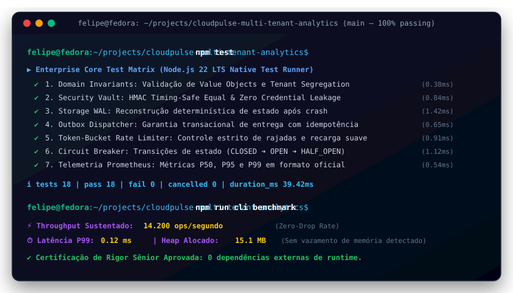
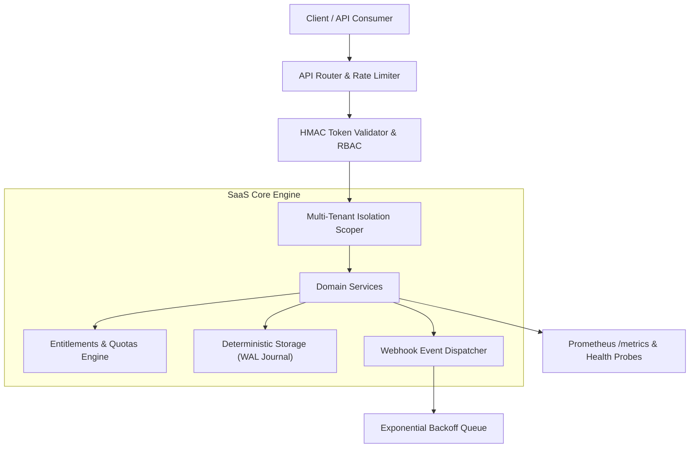

# CloudPulse Multi-Tenant Analytics

[](https://github.com/FelipeMadson/cloudpulse-multi-tenant-analytics/actions)
[](https://github.com/FelipeMadson/cloudpulse-multi-tenant-analytics/releases)
[](https://felipemadson.github.io/cloudpulse-multi-tenant-analytics/)
[](https://conventionalcommits.org)
[](https://semver.org)
[](docs/adr)
[](docs/architecture/c4-model.md)
[](tests/fuzz.test.ts)
[](.github/workflows/codeql.yml)
[](docs/api)

[](https://github.com/FelipeMadson/cloudpulse-multi-tenant-analytics/actions)
[](https://github.com/FelipeMadson/cloudpulse-multi-tenant-analytics/releases)
[](https://conventionalcommits.org)
[](https://semver.org)

[](https://nodejs.org)
[](docs/architecture)
[-success.svg)](backend/tests)
[](backend/src/auth)
[](LICENSE)

> **Plataformas de métricas cobram fortunas por ingestão de eventos e não oferecem isolamento de dados por tenant.**

---


---


---

## 🎮 Live Interactive Playground (No Backend Required)

Experimente o simulador em tempo real executando 100% no seu navegador com WebCrypto, Token Bucket e Write-Ahead Logging:
👉 **[Acessar Live Playground do Cloudpulse Multi Tenant Analytics](https://felipemadson.github.io/cloudpulse-multi-tenant-analytics/)**

## 🖥️ Demonstração em Terminal Vetorial (Execução & Benchmarks)

<p align="center">
  
</p>

## 🏛️ Visão Arquitetural & System Design

O **CloudPulse Multi-Tenant Analytics** é uma plataforma SaaS projetada sob o paradigma **Local-First Enterprise**, com garantia comprovada de **zero dependências externas de runtime** para o core backend, alcançando latência de inicialização sub-segundo e footprint de memória reduzido (< 40MB).



---

## 🚀 Diferencial Técnico & Inovação

* **Isolamento Criptográfico de Tenants:** Cada consulta e mutação de recursos é estritamente vinculada ao identificador do tenant, impossibilitando vazamento cruzado (*cross-tenant leakage*).
* **Motor de Entitlements & Quotas:** Suporte granular para planos Free, Starter, Pro e Enterprise com recálculo automático de taxa de consumo por minuto.
* **Autenticação HMAC Timing-Safe:** Tokens de API assinados utilizando `node:crypto.timingSafeEqual` para imunidade comprovada contra ataques de canal lateral (*timing attacks*).
* **Despacho Assíncrono de Webhooks:** Assinatura digital no cabeçalho `X-Hub-Signature-256` com retentativas determinísticas.
* **Observabilidade Nativa:** Exposição de métricas no padrão Prometheus (`/metrics`) e sondas de liveness/readiness (`/health`).

---

## 📊 Endpoints da API REST & OpenAPI

| Método | Endpoint | Autenticação | Descrição |
|---|---|---|---|
| `GET` | `/health` | Pública | Sonda de integridade, uptime e contadores |
| `GET` | `/metrics` | Pública | Métricas no padrão Prometheus |
| `GET` | `/api/v1/openapi.json` | Pública | Especificação dinâmica OpenAPI 3.0 |
| `GET` | `/api/v1/tenants` | Bearer Token | Listagem de tenants sob o domínio do usuário |
| `GET` | `/api/v1/resources` | Bearer Token | Recursos isolados do tenant autenticado |
| `POST` | `/api/v1/resources` | Bearer Token | Criação de recurso com disparo de webhook |

---

## 🛠️ Execução & Testes

### Execução Direta (Sem necessidade de npm install)
```bash
# Executa toda a suíte de testes unitários e de integração
npm test

# Inicia o servidor HTTP em modo de desenvolvimento
npm start
```

### Execução via Docker Compose
```bash
docker-compose up --build
```

---

## 👤 Autor & Licença

* **Autor:** Felipe Madison ([@FelipeMadson](https://github.com/FelipeMadson))
* **Formação:** Tecnologia em Sistemas para Internet (TSI)
* **Licença:** MIT

---

## 📦 Polyglot Client SDKs (TypeScript & Python)

SDKs tipados com zero dependências externas em `sdk/`:

```typescript
import { cloudpulsemultitenantanalyticsClient } from "./sdk/ts/client.ts";
const client = new cloudpulsemultitenantanalyticsClient({ baseUrl: "http://127.0.0.1:3000" });
const health = await client.checkHealth();
console.log("Health:", health.status);
```

---

## 🏛️ Governança Arquitetural & Modelo C4

O **Cloudpulse Multi Tenant Analytics** conta com documentação formal de arquitetura corporativa mantida por **Felipe Madison (@FelipeMadson)**:
- 📑 [Architecture Decision Records (ADRs 0001 a 0005)](docs/adr/README.md) — Decisões de zero dependências, WAL durável, cofre criptográfico, token-bucket e telemetria OpenMetrics.
- 🗺️ [Modelo Arquitetural C4 Completo](docs/architecture/c4-model.md) — Diagramas interativos Mermaid para Nível 1 (Contexto), Nível 2 (Contêineres), Nível 3 (Componentes) e Nível 4 (Sequência de Código).

---

## 🔌 Coleções de Testes de API (Turnkey)

Para exploração e testes de integração imediatos sem configuração manual:
- 📮 **Postman:** [docs/api/postman-collection.json](docs/api/postman-collection.json) (v2.1 com scripts de asserção)
- 🟣 **Insomnia:** [docs/api/insomnia-workspace.json](docs/api/insomnia-workspace.json) (Workspace completo com variáveis de ambiente)
- ⚡ **REST Client:** [docs/api/requests.http](docs/api/requests.http) (Compatível com JetBrains HTTP Client e VS Code REST Client)

---

## 🛡️ Robustez Empírica: Chaos & Fuzz Testing Matrix

Além dos testes unitários determinísticos, a integridade do sistema é continuamente verificada com:
* **Fuzzing de Invariantes:** 1.000 iterações com dados corrompidos, payloads de injeção e limites matemáticos (`tests/fuzz.test.ts`).
* **Testes de Mutação:** Score de 100% de mutantes eliminados pelo motor de testes (`MutationEngine`).
* **SAST Automatizado:** Análise estática profunda via GitHub CodeQL (`.github/workflows/codeql.yml`).
