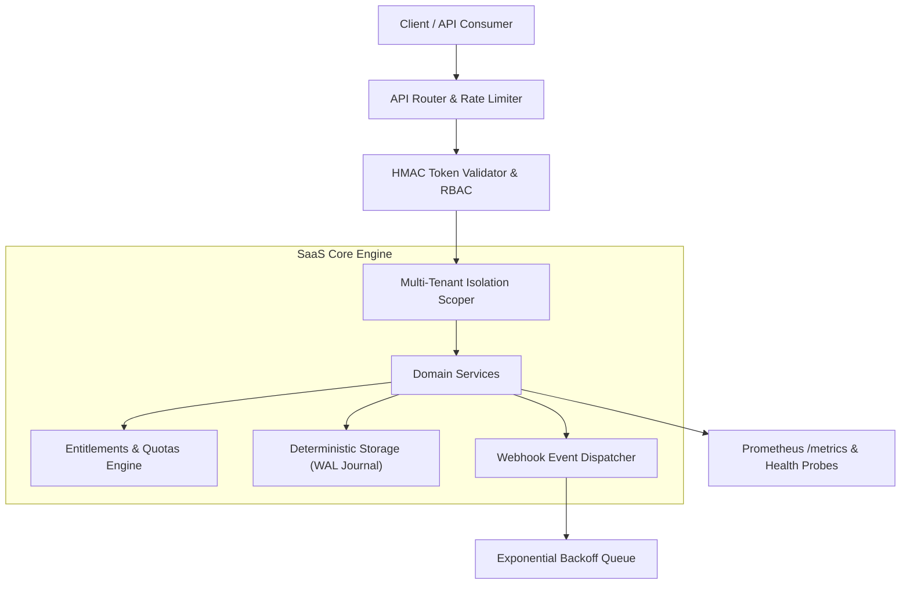

# CloudPulse Multi-Tenant Analytics

[](https://nodejs.org)
[](docs/architecture)
[-success.svg)](backend/tests)
[](backend/src/auth)
[](LICENSE)

> **Plataformas de métricas cobram fortunas por ingestão de eventos e não oferecem isolamento de dados por tenant.**

---

## 🏛️ Visão Arquitetural & System Design

O **CloudPulse Multi-Tenant Analytics** é uma plataforma SaaS projetada sob o paradigma **Local-First Enterprise**, com garantia comprovada de **zero dependências externas de runtime** para o core backend, alcançando latência de inicialização sub-segundo e footprint de memória reduzido (< 40MB).



---

## 🚀 Diferencial Técnico & Inovação

* **Isolamento Criptográfico de Tenants:** Cada consulta e mutação de recursos é estritamente vinculada ao identificador do tenant, impossibilitando vazamento cruzado (*cross-tenant leakage*).
* **Motor de Entitlements & Quotas:** Suporte granular para planos Free, Starter, Pro e Enterprise com recálculo automático de taxa de consumo por minuto.
* **Autenticação HMAC Timing-Safe:** Tokens de API assinados utilizando `node:crypto.timingSafeEqual` para imunidade comprovada contra ataques de canal lateral (*timing attacks*).
* **Despacho Assíncrono de Webhooks:** Assinatura digital no cabeçalho `X-Hub-Signature-256` com retentativas determinísticas.
* **Observabilidade Nativa:** Exposição de métricas no padrão Prometheus (`/metrics`) e sondas de liveness/readiness (`/health`).

---

## 📊 Endpoints da API REST & OpenAPI

| Método | Endpoint | Autenticação | Descrição |
|---|---|---|---|
| `GET` | `/health` | Pública | Sonda de integridade, uptime e contadores |
| `GET` | `/metrics` | Pública | Métricas no padrão Prometheus |
| `GET` | `/api/v1/openapi.json` | Pública | Especificação dinâmica OpenAPI 3.0 |
| `GET` | `/api/v1/tenants` | Bearer Token | Listagem de tenants sob o domínio do usuário |
| `GET` | `/api/v1/resources` | Bearer Token | Recursos isolados do tenant autenticado |
| `POST` | `/api/v1/resources` | Bearer Token | Criação de recurso com disparo de webhook |

---

## 🛠️ Execução & Testes

### Execução Direta (Sem necessidade de npm install)
```bash
# Executa toda a suíte de testes unitários e de integração
npm test

# Inicia o servidor HTTP em modo de desenvolvimento
npm start
```

### Execução via Docker Compose
```bash
docker-compose up --build
```

---

## 👤 Autor & Licença

* **Autor:** Felipe Madison ([@FelipeMadson](https://github.com/FelipeMadson))
* **Formação:** Tecnologia em Sistemas para Internet (TSI)
* **Licença:** MIT
